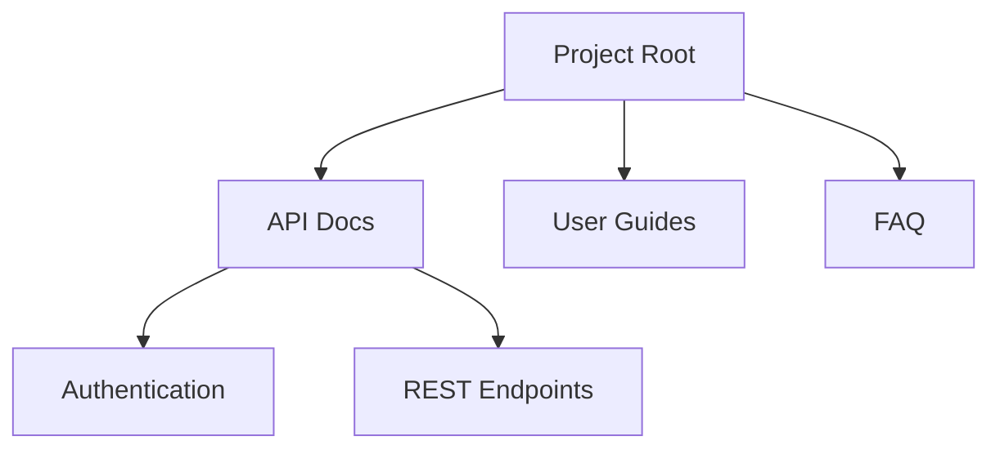

## Overview

Deni Irizbaev provides powerful tools to streamline your documentation workflow. You organize documents into intuitive folder structures, manage projects with robust tools, search efficiently across content, and export or share with ease. These core features help you maintain organized, accessible documentation spaces.

## Key Features

<Columns cols={2}>
  <Card title="Document Organization" icon="folder" href="#document-organization">
    Create nested folders to categorize your docs logically.
  </Card>
  <Card title="Project Management" icon="settings" href="#project-management">
    Track progress, assign tasks, and collaborate seamlessly.
  </Card>
  <Card title="Search and Filtering" icon="search" href="#search-filtering">
    Find content quickly with advanced search options.
  </Card>
  <Card title="Export and Sharing" icon="share-2" href="#export-sharing">
    Generate exports and share links securely.
  </Card>
</Columns>

## Document Organization and Folders

You structure your documentation using folders and subfolders. Start by creating a root folder for your project, then nest subfolders for topics like APIs, guides, and FAQs.

<Steps>
  <Step title="Create a Folder" icon="plus">
    Navigate to your project dashboard and click the `+ Folder` button.
    
    ```javascript
    // Example API call to create a folder
    await fetch('https://api.example.com/v1/folders', {
      method: 'POST',
      headers: { 'Authorization': 'Bearer YOUR_API_KEY' },
      body: JSON.stringify({ name: 'API Docs', parentId: 'root' })
    });
    ```
  </Step>
  <Step title="Add Documents" icon="file-text">
    Drag and drop MDX files into the folder or use the upload interface.
  </Step>
  <Step title="Reorder" icon="move">
    Drag folders to rearrange the hierarchy visually.
  </Step>
</Steps>

<Callout kind="tip">
  Use descriptive names like `user-guide` or `admin-api` for easy navigation.
</Callout>



## Project Management Tools

Manage your documentation projects with built-in tools. You assign collaborators, set milestones, and track changes.

<Tabs>
  <Tab title="Dashboard View" icon="layout">
    View project status at a glance.
    
    | Metric          | Value     |
    |-----------------|-----------|
    | Total Docs      | 45        |
    | Active Folders  | 12        |
    | Collaborators   | 5         |
  </Tab>
  <Tab title="Task Assignment" icon="user-check">
    Assign tasks via the project settings.
    
    ```python
    import requests
    
    response = requests.post(
        'https://api.example.com/v1/projects/YOUR_PROJECT_ID/tasks',
        headers={'Authorization': 'Bearer YOUR_API_KEY'},
        json={'title': 'Review API docs', 'assignee': 'user123'}
    )
    print(response.json())
    ```
  </Tab>
</Tabs>

## Search and Filtering Options

Search across all documents with full-text capabilities. Filter by folder, tags, or date modified.

<CodeGroup tabs="JavaScript,Python">
  ```javascript
  // Search API example
  const results = await fetch('https://api.example.com/v1/search?q=authentication', {
    headers: { 'Authorization': 'Bearer YOUR_API_KEY' }
  }).then(r => r.json());
  
  console.log(results.docs); // Filtered document list
  ```
  ```python
  import requests
  
  params = {'q': 'authentication', 'filter': 'folder:APIs'}
  response = requests.get(
      'https://api.example.com/v1/search',
      headers={'Authorization': 'Bearer YOUR_API_KEY'},
      params=params
  )
  print(response.json()['docs'])
  ```
</CodeGroup>

Use advanced filters like `tag:feature` or `modified>2024-01-01` for precise results.

## Export and Sharing Functionalities

Export your documentation as PDF, HTML, or ZIP. Share public links with granular permissions.

<Expandable title="Advanced Export Options" default-open="false">
  Customize exports with themes and watermarks.
  
  <ParamField path="projectId" param-type="string" required="true">
    Your project identifier.
  </ParamField>
  
  <ParamField query="format" param-type="string" required="false">
    Options: `pdf`, `html`, `zip`. Default: `pdf`.
  </ParamField>
</Expandable>

<Request tabs="cURL,JavaScript" show-lines="true">
  ```bash
  curl -X POST 'https://api.example.com/v1/exports' \
    -H 'Authorization: Bearer YOUR_API_KEY' \
    -H 'Content-Type: application/json' \
    -d '{
      "projectId": "proj_123",
      "format": "pdf"
    }'
  ```
  ```javascript
  await fetch('https://api.example.com/v1/exports', {
    method: 'POST',
    headers: {
      'Authorization': 'Bearer YOUR_API_KEY',
      'Content-Type': 'application/json'
    },
    body: JSON.stringify({
      projectId: 'proj_123',
      format: 'pdf'
    })
  });
  ```
</Request>

<Response tabs="200">
  ```json
  {
    "exportId": "exp_456",
    "status": "processing",
    "downloadUrl": "https://api.example.com/downloads/exp_456.pdf"
  }
  ```
</Response>

<Callout kind="success">
  Exports complete in under `{<30s}` for projects up to 100 documents.
</Callout>